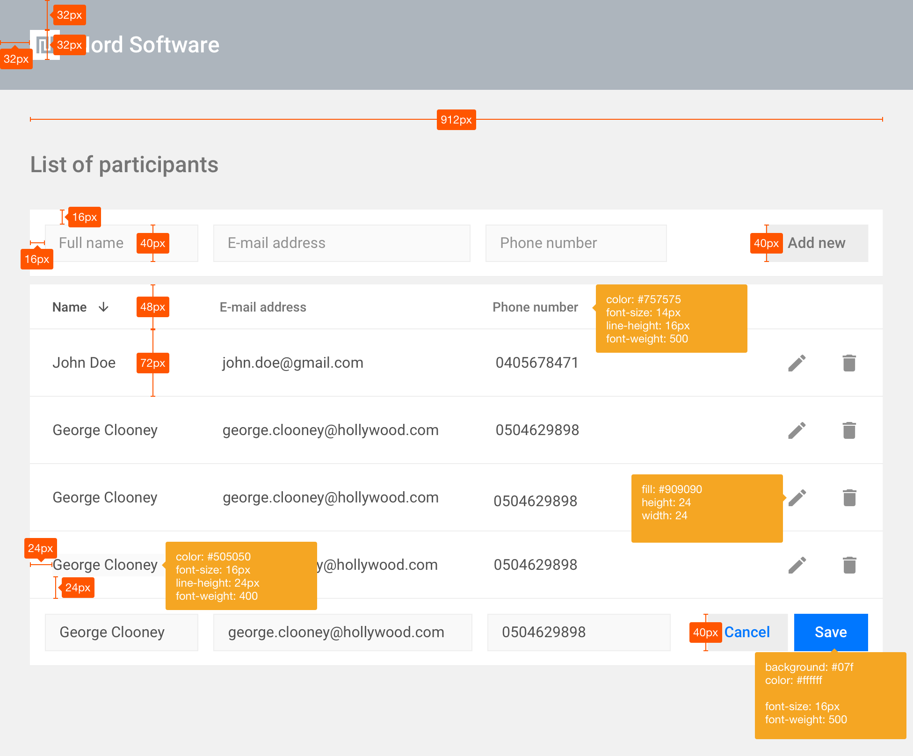
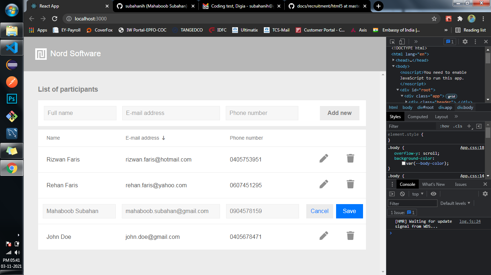
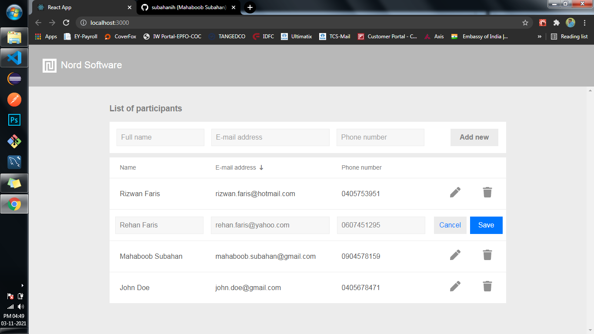

# reactjs-editable-table
ReactJS editable & sortable table

This application is developed using ReactJs. Created editable table will allow user to add new participant, edit a participant and delete a participant.

Implementation:
1. Used React App to scaffold this application.
2. Generated 20 participants that contain randomized values for the following properties: id, name, email address, and phone number.
3. Rendered a table that displays the participants on individual rows.
4. Created a form for adding new participants to the table (validated the form).
5. Made each participant editable by clicking on a table cell (inline editing).
6. Added support for deleting rows.
7. Made each column sortable upon clicking on a column header.
8. Wrote below installation guide on how to run the app.
9. Pushed code to a public GitHub repository(https://github.com/subahanih/eactjs-editable-table).
10. Deployed a live build on the internet(Heroku)
11. FOLLOWED THE DESIGN AS ACCURATELY AS I CAN (I have created a same logo given in the styleguide using Adobe Photoshop).

### Deployed in Heroku
Link: https://reactjs-editable-table.herokuapp.com/

### How to run
    1. npm int
    2. npm install
    3. npm start (Default port is 3000)

### Requirement(styleguide).

### Compressed view from the browser.

### Full view from the browser.

